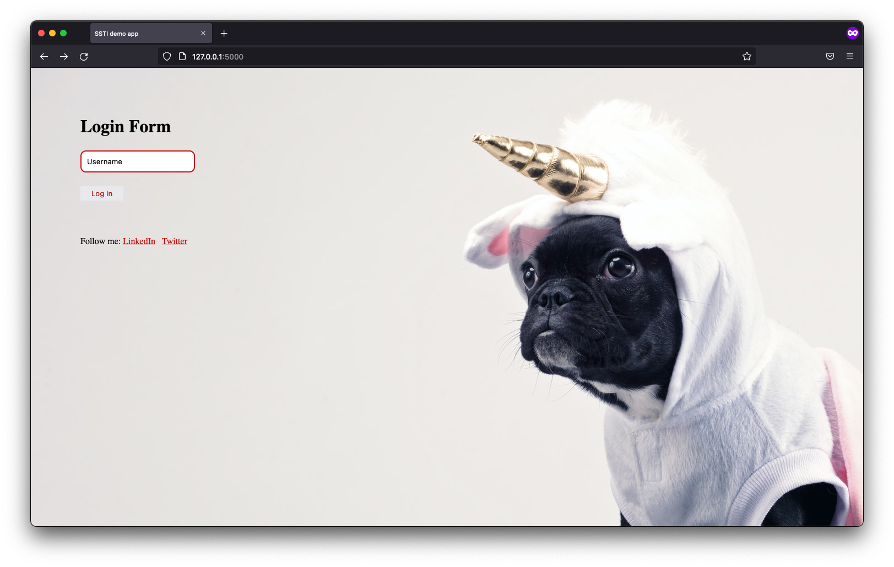
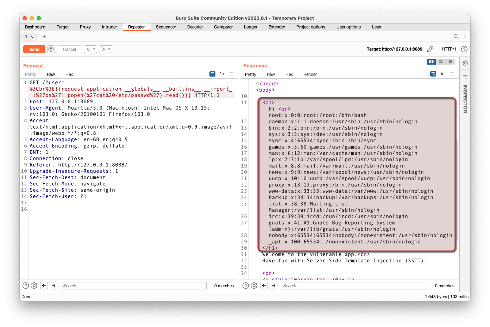

## Vulnerable Web App: ssti-flask-hacking-playground 

This is small application vulnerable to Server Side Template Injection (SSTI) in Flask/Jinja2. The vulnerability allows for 
Remote Code Execution (RCE). 

The app is dedicated to pentesters and developers who would like to see and better understand the #ssti vulnerability. Will 
you get a reverse shell?

Applications can be exploited in many different ways:



## How to use it - DOCKER

The easiest way is to start the application using docker in Linux.

```
Linux@amd64 (Intel processors):

docker run -p 8089:8089 -d filipkarc/ssti-flask-hacking-playground

Linux@AppleSilicon (tested on Apple M1):

docker run -p 8089:8089 -d filipkarc/ssti-flask-hacking-playground:apple
```

After 1 minute, it should be visible in the browser: http://127.0.0.1:8089


## How to use it - without docker:

```
git clone https://github.com/filipkarc/ssti-flask-hacking-playground.git 

cd ssti-flask-hacking-playground

pip3 install -r requirements.txt 

python3 __init__.py
```


You can now check in your browser: http://127.0.0.1:8089


## Follow me

Follow me on [Twitter @FilipKarc](https://twitter.com/FilipKarc) and on LinkedIn: [LinkedIn](https://www.linkedin.com/in/filip-karczewski/).


  
